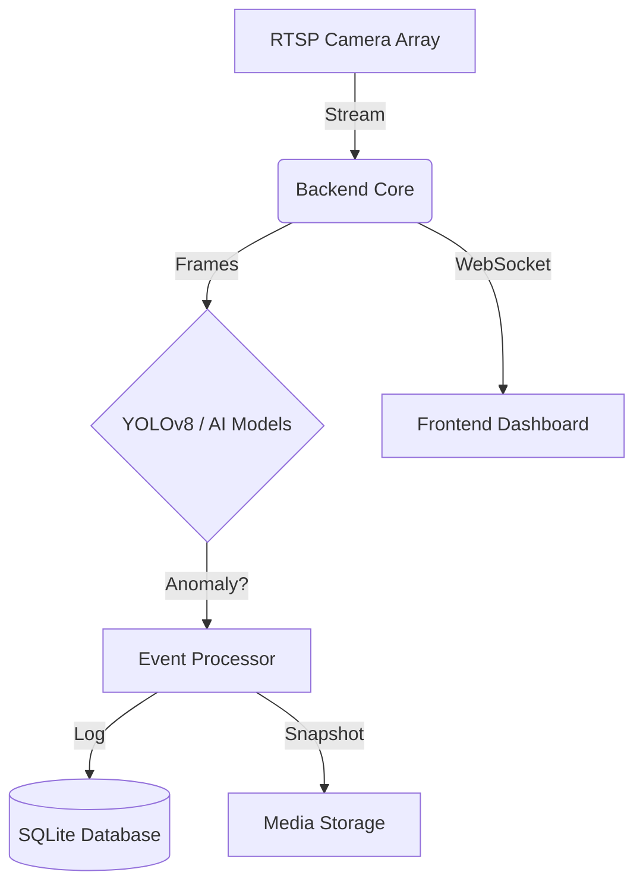

# Automated CCTV Surveillance System (ACSS)

> **"Privacy is a myth. Security is a process."**


## 👁️ Overview

**ACSS** is a high-performance, real-time surveillance pipeline designed for the **automated detection of security anomalies**. Built for speed and reliability, it leverages **YOLOv8** inference to identify threats (e.g., Intruders, Mobile Phones) and provides instant alerts via a modern, reactive dashboard.

This is not just a camera viewer. It is an **intelligence layer** for your physical security infrastructure.

## ⚡ Key Capabilities

*   **Real-Time Inference**: Optimized YOLOv8 pipeline forsub-second detection latency.
*   **Asynchronous Core**: Non-blocking FastAPI backend ensures video streams never freeze.
*   **Edge-Ready**: Runs on local hardware with NVIDIA CUDA acceleration (or CPU fallback).
*   **Smart Alerts**: Instant detection and logging of security events.
*   **Modern Dashboard**: A premium "Apple-style" interface built with React, Vite, and TailwindCSS.

## 🏗️ Architecture



## 📂 Project Structure

The project is organized into two main components:

### Backend (`backend/`)
-   **`ai_models/`**: Stores YOLOv8 model weights (`yolov8n.pt`).
-   **`app/`**: Core application logic (API, detection services, database).
-   **`data/`**: SQLite databases (`cctv.db`) and test media.
-   **`scripts/`**: Utility scripts for debugging and testing.
-   **`logs/`**: Application logs.

### Frontend (`frontend/`)
-   **`src/`**: React source code (Components, Pages, Context).
-   **`public/`**: Static assets.

## 🛠️ Installation & Setup

### Prerequisites
*   **Python 3.10+**
*   **Node.js 18+**
*   (Optional) NVIDIA GPU + CUDA Toolkit for acceleration

### 🚀 Automated Setup

**1. Clone the Repository**
```bash
git clone https://github.com/yourusername/automated-cctv-monitoring.git
cd automated-cctv-monitoring
```

**2. Run Setup Script**
*   **Windows (PowerShell)**:
    ```powershell
    .\setup.ps1
    ```
*   **Linux / macOS**:
    ```bash
    chmod +x setup.sh
    ./setup.sh
    ```

### 🚦 Running the Application

**1. Start Backend Server**
Open a terminal in the root directory:
```bash
cd backend
# Activate Virtual Environment
# Windows:
.\venv\Scripts\activate
# Linux/Mac:
source venv/bin/activate

# Run Server
uvicorn app.main:app --reload
```
*The backend API will run at `http://localhost:8000`.*

**2. Start Frontend Dashboard**
Open a second terminal in the root directory:
```bash
cd frontend
npm run dev
```
*The dashboard will run at `http://localhost:5173`.*

## 🧪 Testing & Debugging

-   **Debug Images**: Run `python backend/scripts/debug_images.py` to check database connections and image paths.
-   **Verify Stream**: Ensure your camera inputs are valid in the settings page.

## ⚠️ Legal & Ethical Disclaimer

**READ CAREFULLY.**

This software is provided for **educational, research, and authorized defensive security purposes only**.

*   **Consent**: Do not use this software to monitor individuals without their explicit consent or legal authorization.
*   **Compliance**: You are solely responsible for ensuring that your use of this software complies with all applicable local, state, and federal laws regarding privacy and surveillance.
*   **Liability**: The authors and contributors explicitly disclaim any liability for the misuse of this software.

## 🔒 Security Notes

*   **Credentials**: Never commit `.env` files to version control.
*   **Access Control**: Ensure the application is behind a secure firewall if exposed to the network.
*   **Data Privacy**: All event logs and snapshots are stored locally in `backend/data` and `backend/media`.

---

*Initiative 710. End of Line.*
