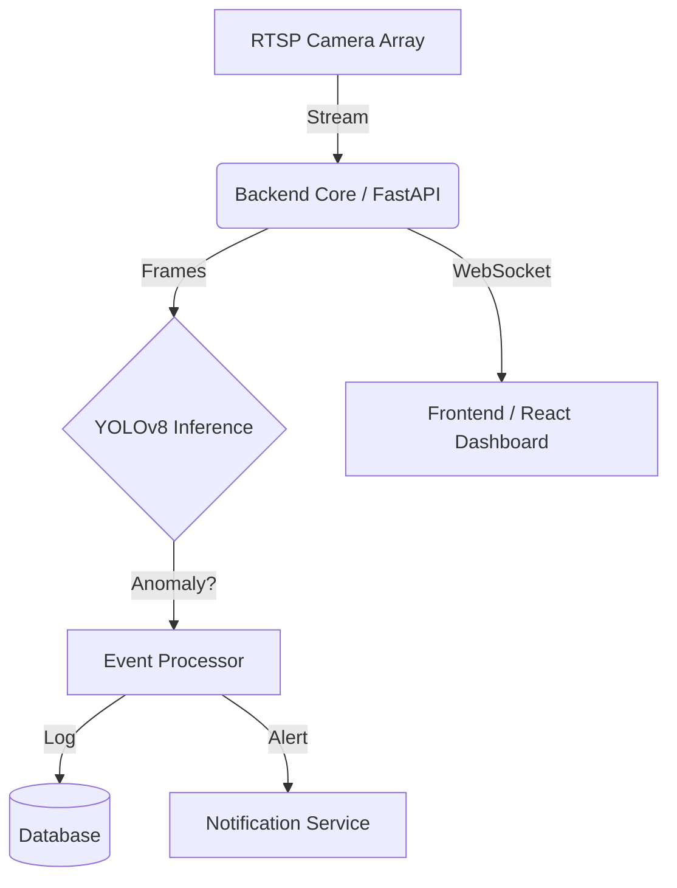

# Automated CCTV Surveillance System (ACSS)

> **"Privacy is a myth. Security is a process."**


## 👁️ Overview

**ACSS** is a high-performance, asynchronous surveillance pipeline designed for the **automated detection of security anomalies** in real-time. Built for low-latency environments, it leverages **YOLOv8** inference to identify threats (Intruders, Mobile Phones) and instantly logs events with forensic snapshots.

This is not just a camera viewer. It is an **intelligence layer** for your physical security infrastructure.

## ⚡ Key Capabilities

*   **Real-Time Inference**: Optimized YOLOv8 pipeline for sub-second detection latency.
*   **Asynchronous Core**: Non-blocking architecture ensures video streams never freeze, even under high load.
*   **Edge-Ready**: Capable of running on local hardware with NVIDIA CUDA acceleration or CPU fallback.
*   **Secure by Design**: Implementation of JWT Authentication, secure password hashing, and role-based access control.
*   **Modern Dashboard**: A reactive ("Apple-style") frontend built with Vite & TailwindCSS for a premium command-center experience.

## 🏗️ Architecture



## 🛠️ Installation & Setup

### Prerequisites
*   **Python 3.10+**
*   **Node.js 18+**
*   (Optional) NVIDIA GPU + CUDA Toolkit for acceleration

### 🚀 Fast Track (Automated)

**1. Clone the Repository**
```bash
git clone https://github.com/yourusername/automated-cctv-monitoring.git
cd automated-cctv-monitoring
```

**2. Run Setup Script**
*   **Windows (PowerShell)**:
    ```powershell
    .\setup.ps1
    ```
*   **Linux / macOS**:
    ```bash
    chmod +x setup.sh
    ./setup.sh
    ```

**3. Start the System**
*   **Terminal 1 (Backend)**:
    ```bash
    cd backend
    # Windows
    .\venv\Scripts\activate
    # Linux/Mac
    source venv/bin/activate
    
    uvicorn app.main:app --reload
    ```
*   **Terminal 2 (Frontend)**:
    ```bash
    cd frontend
    npm run dev
    ```

### 📦 Manual Setup
If you prefer manual control, see `backend/README.md` (if applicable) or inspect the setup scripts.

## ⚠️ Legal & Ethical Disclaimer

**READ CAREFULLY.**

This software is provided for **educational, research, and authorized defensive security purposes only**.

*   **Consent**: Do not use this software to monitor individuals without their explicit consent or legal authorization.
*   **Compliance**: You are solely responsible for ensuring that your use of this software complies with all applicable local, state, and federal laws regarding privacy and surveillance.
*   **Liability**: The authors and contributors explicitly disclaim any liability for the misuse of this software. By using this software, you agree to hold the authors harmless from any legal action resulting from your usage.

**"With great power comes great responsibility." Don't be "that" guy.**

## 🔒 Security

*   **Credentials**: Never commit `.env` files. Use strong `SECRET_KEY` values in production.
*   **Network**: This system allows full CORS access by default for easy deployment. **Lock this down** before exposing to the public internet.
*   **Updates**: Stay updated. Security is a moving target.

---

*Initiative 710. End of Line.*
